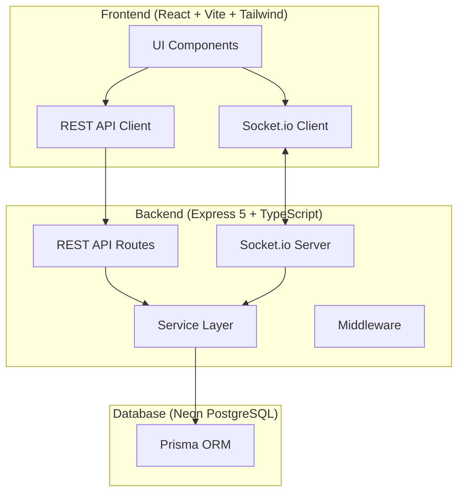
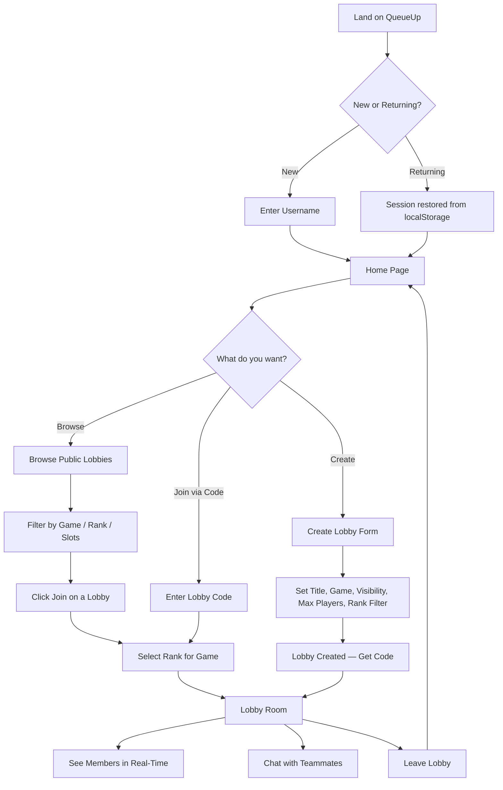

# QueueUp — Requirements & Epic Backlog

## Product Vision

**QueueUp** is a real-time matchmaking platform that eliminates the friction of finding teammates in online games. Solo players or incomplete squads can create or browse lobbies, filter by game and rank, and team up instantly — no account required.

**Launch Games:** PUBG Mobile, Marvel Rivals

---

## Key Decisions

| Decision | Choice | Rationale |
|---|---|---|
| Authentication | None (guest sessions) | Zero friction to entry — users pick a username and go |
| Host Departure | Ownership transfers to earliest member | Lobbies survive host leaving |
| Rank System | Game-specific tiers | Enables smart filtering, not free-text chaos |
| Lobby Discovery | Browsable list + code join | Browse is the core UX; codes are for private invites |
| Chat | Text-only, real-time | Essential for social coordination |
| Frontend | React + Vite + Tailwind CSS | Fast, lightweight, mobile-first by default |
| Backend | Express 5 + Prisma + Socket.io | Already scaffolded, solid stack for real-time |
| Database | PostgreSQL (Neon) | Already provisioned |
| Deployment | TBD (Render / Azure) | Decide in Epic 6 |

---

## Technical Architecture



### Key Architectural Patterns

- **Service Layer**: All business logic lives in `services/`. Controllers and socket handlers are thin — they validate, call services, and respond.
- **Socket Rooms**: Each lobby maps to a Socket.io room (`lobby:{code}`). Join/leave/chat events broadcast to room members.
- **Session via Socket**: No auth — user identity is established when they "register" with a username. A session token (simple UUID) is stored in `localStorage` and sent with every request/socket connection.
- **Lobby Codes**: 6-character alphanumeric codes for private lobby sharing.

---

## Data Model

### Prisma Schema (Refined)

The existing schema is solid. Here are the changes needed:

#### Modifications to existing schema:

1. **`Lobby` model** — Add `isActive` (Boolean, default true) for soft-delete/close and `rankFilter` (optional, for rank-restricted lobbies)
2. **`User` model** — Add `sessionToken` (String, unique) for guest session persistence
3. **`LobbyMember` model** — Already good
4. **`Message` model** — Already good

#### New: Game-Specific Rank Enums

```
PUBG Mobile Ranks:
  BRONZE, SILVER, GOLD, PLATINUM, DIAMOND, CROWN, ACE, ACE_MASTER, ACE_DOMINATOR, CONQUEROR

Marvel Rivals Ranks:
  BRONZE_III, BRONZE_II, BRONZE_I,
  SILVER_III, SILVER_II, SILVER_I,
  GOLD_III, GOLD_II, GOLD_I,
  PLATINUM_III, PLATINUM_II, PLATINUM_I,
  DIAMOND_III, DIAMOND_II, DIAMOND_I,
  GRANDMASTER_III, GRANDMASTER_II, GRANDMASTER_I,
  CELESTIAL_III, CELESTIAL_II, CELESTIAL_I,
  ETERNITY, ONE_ABOVE_ALL
```

> [!IMPORTANT]
> Since ranks are game-specific and there are many tiers, I recommend **not** using Prisma enums for ranks. Instead, store them as `String` in the DB and define the rank tier lists as **constants in application code** (shared between server and client). This avoids a migration every time we add a game or rank changes. The `rank` field on `User` becomes per-game — we'll need a `GameProfile` model or store rank on `LobbyMember` (since a user may have different ranks in different games).

**Proposed approach**: Store rank on `LobbyMember` (not `User`), since a user's rank is game-contextual. When creating/joining a lobby, the user selects their rank for *that game*. This keeps the `User` model clean and game-agnostic.

---

## User Flow



---

## Pages & Components

| Page | Route | Description |
|---|---|---|
| Landing / Home | `/` | Hero + quick actions (Browse, Create, Join by Code) |
| Browse Lobbies | `/browse` | Filterable list of public lobbies with live player counts |
| Create Lobby | `/create` | Form: title, game, visibility, max players, rank filter |
| Lobby Room | `/lobby/:code` | Live member list, chat, lobby info, share code, leave button |
| Join (via code) | `/join?code=XXXXXX` | Quick-join flow with rank selection |

---

## API Design

### REST Endpoints

| Method | Endpoint | Description |
|---|---|---|
| `POST` | `/api/users` | Create guest user (username → sessionToken) |
| `GET` | `/api/users/me` | Get current user by session token |
| `POST` | `/api/lobbies` | Create a lobby |
| `GET` | `/api/lobbies` | List public lobbies (with filters: game, rank, hasSlots) |
| `GET` | `/api/lobbies/:code` | Get lobby details + members |
| `POST` | `/api/lobbies/:code/join` | Join a lobby |
| `POST` | `/api/lobbies/:code/leave` | Leave a lobby |
| `GET` | `/api/lobbies/:code/messages` | Get chat history (paginated) |
| `GET` | `/api/games` | Get supported games + rank tiers |

### Socket Events

| Event | Direction | Payload | Description |
|---|---|---|---|
| `lobby:join` | Client → Server | `{ lobbyCode, sessionToken }` | User joins lobby socket room |
| `lobby:leave` | Client → Server | `{ lobbyCode }` | User leaves lobby socket room |
| `lobby:member-joined` | Server → Room | `{ member }` | Broadcast: new member joined |
| `lobby:member-left` | Server → Room | `{ userId, newHost? }` | Broadcast: member left (+ new host if applicable) |
| `lobby:updated` | Server → Room | `{ lobby }` | Broadcast: lobby state changed |
| `lobby:closed` | Server → Room | `{}` | Broadcast: lobby has been closed |
| `chat:message` | Client → Server | `{ lobbyCode, content }` | Send a chat message |
| `chat:new-message` | Server → Room | `{ message }` | Broadcast: new chat message |

---

## Open Questions

> [!IMPORTANT]
> **Rank Filtering Strictness**: When a lobby has a rank filter set (e.g., "Diamond+"), should we:
> - (A) **Hard block** — users below that rank literally cannot join
> - (B) **Soft filter** — show a warning but allow joining anyway
> 
> My recommendation is **(A) hard block** for v1 — it matches how the actual games work. Thoughts?

> [!NOTE]
> **Lobby Expiration**: Should we add an auto-cleanup job that marks lobbies as inactive after, say, 60 minutes of no activity? This keeps the browse list clean. Not critical for v1 but good to plan for.

---

## Epic Backlog

### Epic 1: Backend Foundation 🏗️
> *Get the server running with a clean API layer*

- [x] Prisma schema (exists, needs refinement)
- [ ] Fix schema: add `isActive` to Lobby, move `rank` to `LobbyMember`, add `sessionToken` to User
- [ ] Run migration
- [ ] Define game/rank constants in shared config
- [ ] Set up Express app (`app.ts`) with middleware (cors, json, error handler)
- [ ] Set up `server.ts` with HTTP + Socket.io
- [ ] Implement `userService` — `createGuestUser`, `getUserBySession`
- [ ] Implement `lobbyService` — `createLobby`, `joinLobby`, `leaveLobby`, `listPublicLobbies`, `getLobbyByCode`, `closeLobby`, `transferHost`
- [ ] Build REST controllers + routes for all endpoints
- [ ] Add session middleware (extract user from `x-session-token` header)
- [ ] Update seed script
- [ ] Test all endpoints manually / with curl

### Epic 2: Real-Time Infrastructure ⚡
> *WebSocket layer for live lobby updates and chat*

- [ ] Set up Socket.io server with connection handling
- [ ] Implement socket authentication (session token on connect)
- [ ] Implement lobby room join/leave
- [ ] Broadcast member-joined / member-left events
- [ ] Handle host transfer on host disconnect
- [ ] Implement chat message sending + broadcasting
- [ ] Handle disconnection cleanup (mark user as left if disconnected for >30s)
- [ ] Test with multiple Socket.io clients

### Epic 3: Frontend Shell & Lobby Browse 🎨
> *React app with routing, design system, and the lobby browse experience*

- [ ] Initialize React + Vite + Tailwind project in `client/`
- [ ] Set up routing (React Router)
- [ ] Build design system: color palette, typography, component tokens (gaming aesthetic — dark theme, neon accents, glassmorphism)
- [ ] Build Layout component (nav, footer)
- [ ] Build Landing/Home page — hero, quick actions
- [ ] Build Browse Lobbies page — lobby cards, filters (game, rank, available slots)
- [ ] Build Create Lobby page — form with game selector, rank filter, visibility toggle
- [ ] Implement guest user flow (username entry → session stored in localStorage)
- [ ] Wire up REST API client (axios or fetch)
- [ ] Connect Browse page to `GET /api/lobbies`
- [ ] Connect Create page to `POST /api/lobbies`

### Epic 4: Lobby Room Experience 🎮
> *The core interactive experience — live lobby with members and real-time updates*

- [ ] Build Lobby Room page (`/lobby/:code`)
- [ ] Display lobby info (title, game, code, host, rank filter)
- [ ] Display live member list with roles and ranks
- [ ] Implement Socket.io client — connect, join room, listen for updates
- [ ] Real-time member join/leave with animations
- [ ] Share lobby code (copy to clipboard + shareable link)
- [ ] Leave lobby button with confirmation
- [ ] Host controls (close lobby, kick member — stretch)
- [ ] Handle lobby-not-found and lobby-closed states

### Epic 5: In-Lobby Chat 💬
> *Real-time text chat within lobbies*

- [ ] Build Chat component (message list + input)
- [ ] Load chat history on lobby join (`GET /api/lobbies/:code/messages`)
- [ ] Send messages via socket (`chat:message`)
- [ ] Receive and render new messages in real-time (`chat:new-message`)
- [ ] Auto-scroll to latest message
- [ ] Show sender username + timestamp
- [ ] System messages (e.g., "Player X joined the lobby")

### Epic 6: Polish, Testing & Deploy 🚀
> *Make it production-ready and deploy*

- [ ] Responsive design audit (mobile, tablet, desktop)
- [ ] Loading states and skeleton screens
- [ ] Error handling and toast notifications
- [ ] Empty states (no lobbies found, etc.)
- [ ] Lobby expiration / cleanup logic
- [ ] Environment config for production
- [ ] Deploy backend (Render / Azure)
- [ ] Deploy frontend (Vercel / same platform)
- [ ] End-to-end smoke test
- [ ] README with setup instructions

---

## Tech Stack Summary

| Layer | Technology |
|---|---|
| Frontend | React 19, Vite, Tailwind CSS, React Router, Socket.io Client |
| Backend | Express 5, TypeScript, Socket.io |
| ORM | Prisma 7 (with `@prisma/adapter-pg`) |
| Database | PostgreSQL (Neon) |
| Real-Time | Socket.io (WebSocket + fallback) |
| Dev Tools | tsx, nodemon, ESM modules |

---

## File Structure (Target)

```
QueueUp/
├── client/                     # React + Vite frontend
│   ├── src/
│   │   ├── components/         # Reusable UI components
│   │   ├── pages/              # Route pages
│   │   ├── hooks/              # Custom React hooks
│   │   ├── services/           # API + socket clients
│   │   ├── constants/          # Game configs, rank tiers
│   │   ├── context/            # React context (user session)
│   │   ├── App.tsx
│   │   ├── main.tsx
│   │   └── index.css
│   ├── index.html
│   ├── tailwind.config.js
│   ├── vite.config.ts
│   └── package.json
│
├── server/                     # Express + Socket.io backend
│   ├── prisma/
│   │   └── schema.prisma
│   ├── libs/
│   │   └── prisma.ts
│   ├── constants/              # Game configs, rank tiers (shared source of truth)
│   │   └── games.ts
│   ├── controllers/
│   │   ├── userController.ts
│   │   └── lobbyController.ts
│   ├── services/
│   │   ├── userService.ts
│   │   └── lobbyService.ts
│   ├── routes/
│   │   ├── userRoutes.ts
│   │   └── lobbyRoutes.ts
│   ├── sockets/
│   │   ├── index.ts
│   │   ├── lobbyHandlers.ts
│   │   └── chatHandlers.ts
│   ├── middleware/
│   │   ├── session.ts
│   │   └── errorHandler.ts
│   ├── utils/
│   │   └── generateCode.ts
│   ├── app.ts
│   ├── server.ts
│   └── package.json
│
└── README.md
```

> [!TIP]
> I've renamed `app.js` → `app.ts` and `server.js` → `server.ts` since the whole backend is TypeScript. The existing `.js` files are empty anyway.
